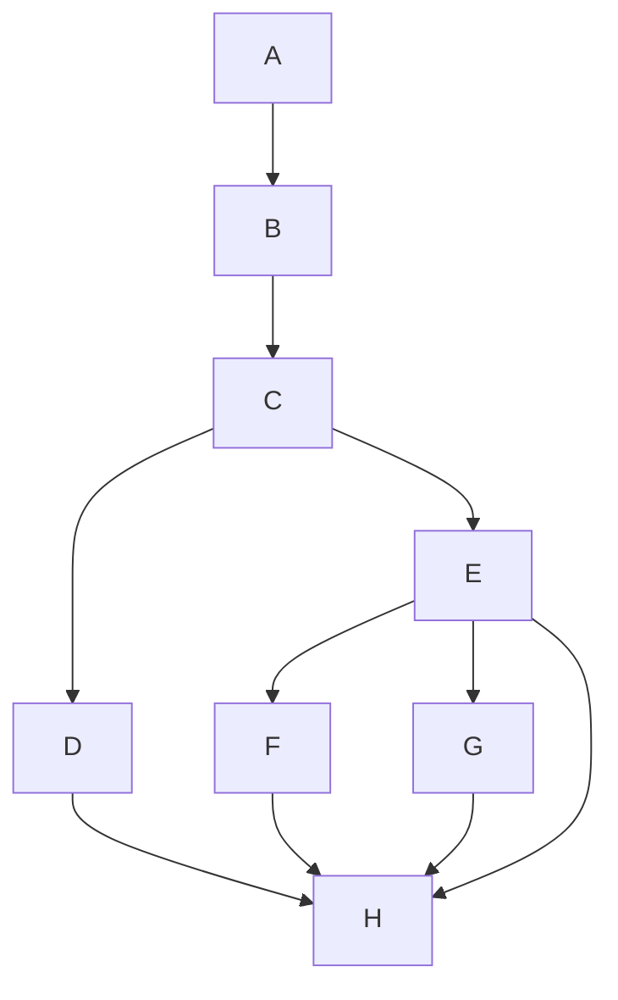

# Chapter 3: Control Flow: if-else, relational operators, boolean operators
## Background 
At this point in the course, the programs we have written have a very linear flow. There is a set of instructions we give the program for it to make it from point a to point b, and it does not veer off or go in different directions.

But in many cases, we need to control what the program does based on user input, or the state of a variable. We want to control the flow of our program as it runs to give us multiple options for routes it can take.

## The `if` Statement
- The `if` statement is used to implement a decision in the program. It is made up of a condition and a body.
	- The condition of an `if` statement is made up of an expression that evaluates to TRUE or FALSE. It typically compares values using relational operators.
	- The body of an `if` statement is made up of either one statement or multiple statements. These statements will run ONLY if the condition evaluates to TRUE.

###### C++ Syntax for if statements
```c++
if(condition)
	single statement body```
```c++
if(condition) {
//multiple statements body
}```

- If there is more than one statement in the body, you MUST use curly braces.

__if.cpp__
```c++
/*
 * Program Description: Example program for a simple if statement
 */
#include <iostream>  
using namespace std;  
int main()  
{
	//initialize variables
	int num = 0;
	//prompt user for a value
	cout << "Please enter a number greater than zero:";
	cin >> num;//store user input into variable
	cout << "You entered: " << num << "\n";
	//this if statement will check if the number
	//entered is less than or equal to zero
	//if, and only if, it is true, the body of the if statement will run
	if(num <= 0)
	cout << "You did not listen to my instructions!\n";
	return 0;
}
```

## Relational Operators
The condition of `if` statements typically compares values with one another.  
To do this comparison, we use relational operators.
|Operator Name|Operator|Example Expression|
|-|-|-|
|Equal To|\=\=|a \=\= b|
|Not Equal To|!=|a != b|
|Less Than|<|a < b|
|Greater Than|>|a > b|
|Less Than or Equal To|<=|a <= b|
|Greater Than or Equal To|>=|a >= b|

These operators are used to compare the values between two expressions. The expression demonstrated can be  
either TRUE or FALSE.
###### Example
`int a = 10, b = 12, c = 5;`
|Expression|True or False?|
|-|-|
|a \=\= b|False|
|a+5 > b|True|
|c % 2 \=\= 0|False|
|b+2<=14|True|

## The `if-else` statement  
- You can also pair an `if` with an `else`.  
	- If the condition following the `if` is TRUE, the body of the `if` will execute.  
		- If the condition following the `if` is FALSE, the body of the else will execute.  
	- Only ONE body will run.  
	- C++ Syntax for if-else statements  


- Note: an `else` does not have a condition associated with it. Its performance is based on  
whether the previous condition(s) evaluates to TRUE or FALSE
###### Example



```
__if.cpp__
```c++
/*
 * Program Description: Example program for a simple if statement
 */
#include <iostream>  
using namespace std;  
int main()  
{
	//initialize variables
	int num = 0;
	//prompt user for a value
	cout << "Please enter a number greater than zero:";
	cin >> num;//store user input into variable
	cout << "You entered: " << num << "\n";
	//this if statement will check if the number
	//entered is less than or equal to zero
	//if, and only if, it is true, the body of the if statement will run
	if(num <= 0)
	cout << "You did not listen to my instructions!\n";
	return 0;
}
```
__if_else.cpp__
```c++
/*
 * Program Description: Example program for a simple if-else statement
 */ 
#include <iostream>
using namespace std;

int main()
{
	//initialize variables
	int num = 0;
	cout << "Please enter a number greater than zero:";
	cin >> num;
	cout << "You entered: " << num << "\n";
	
	//this if statement will check if the number
	//entered is less than or equal to zero.
	if(num <= 0)
		cout << "You did not listed to my instructions!\n";
	//this else will only run if the above if evaluates to false
	else{
		//if the number is greater than zero, the following
		//if statement will check if it is divisible by 2
		if(num % 2 == 0) // check if num is even
			cout << num << " is even.\n";
		else
			cout << num << " is odd.\n";
	}
	//regardless of whether the if or the else above runs, the program will always end
	return 0;
}

```
__if_else_if.cpp__
```c++
/*
 * Program Description: Example program for a simple if-else statement
 * that prints whether a number is negative, zero, or positive
 */
#include <iostream>
using namespace std;

int main()
{
	//initialize variables
	int num = 0;
	//prompt the user for an integer
	cout << "Enter an integer:";
	cin >> num;
	
	//the program will check the following conditions from top to bottom
	//Once one evaluates to true, it will execute its body and ignore the remaining
	//ones. If none are true, the final else will run
	if (num == 0)
		cout << "You entered zero.\n";
	else if(num > 0)
		cout << "You entered a positive integer.\n";
	else 
		cout << "You entered a negative integer.\n";
	
	return 0;
}

```