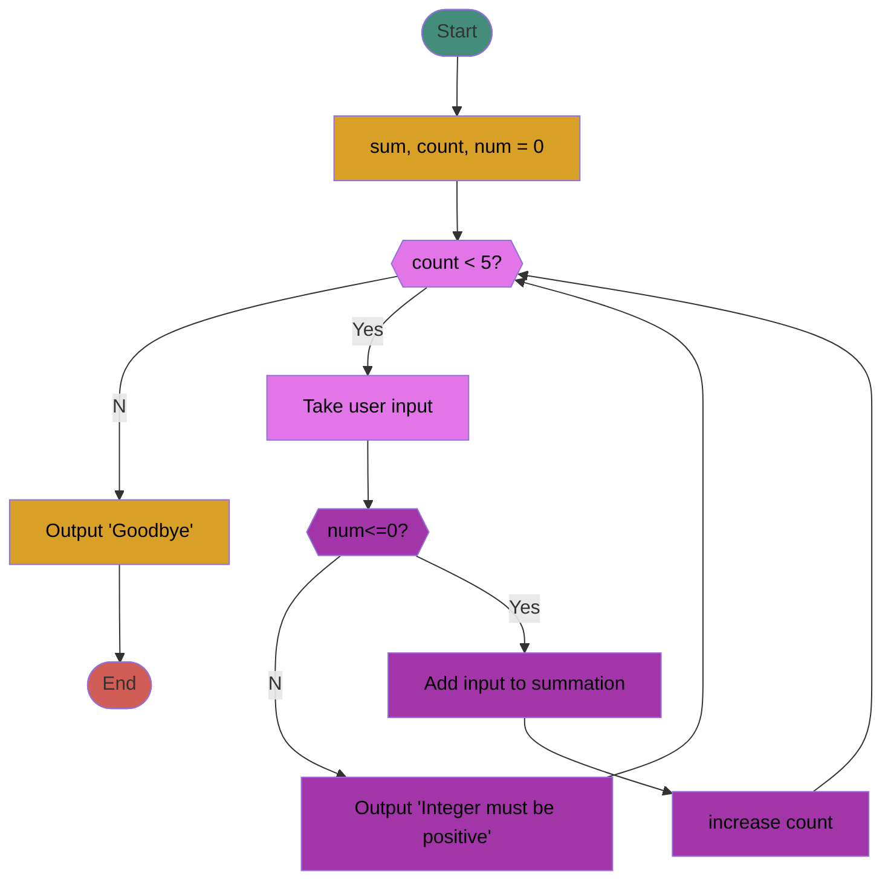

# Chapter 3: Loops, loops, and more loops
## What this lecture will cover...
### Loops  
- What they are  
- Different parts of a loop  
- Different types of loops  
	- while loop  
	- for loop  
	- do-while loop  
- Nested loops  
- How to use loops to process user input
### Background
With most programs we write, we will want to repeat a specific  
action/task/chunk of code more than once.  
###### Examples:  
	- Processing user input.  
	- ATMs: The menu loops until the user selects the option to quit.  
- Loops in programming allow us to repeat a chunk of code as many times  
as we want without having to retype the code over and over again.  
- C++ has the following loops available:  
	- `while`
	- `for `
	- `do-while`
### General Format for Loops
- Regardless of the loop type, there are important “parts” of a loop that you should keep in mind  
to make sure it works properly.  
- Initialization Statement
	- The initialization statement will initialize the variable that will control the loop, or the loop control variable (LCV).
	This variable will be the main determinant of how many times the loop will execute and will typically be part of the loop condition.  
-  Loop Condition
	- For while and for loops, this condition must evaluate to TRUE in order for the loop to begin and continue. (do-while is a little different).  
	- The LCV value is typically checked here.  
	- Once this condition evaluates to FALSE, the program breaks out of the loop and proceeds to the statement directly after the end of the loop.  
	- The condition can be made up of a Boolean expression, Boolean variables, integers, cin statements, etc.  
-  Body
	- Contains the statements/code that you wish to repeat while the loop runs.  
	- The loop body is able to use variables that are declared outside of the loop, and you can declare new variables inside the loop. Loop variables will only exist while the loop is running.  
-  Update Statement
	- At some point in your loop, you need to make sure to update the LCV so that eventually your loop will end.  
	- Without this, you risk having an infinite loop.

### `while` Loop
The while loop executes a block of code repeatedly WHILE its condition  
continues to evaluate to TRUE.  
###### C++ Syntax
```c++
initialization statement;
while(condition){
	//Body of loop
	//Update statement;
}
```

### Example: Write a program to display “Hello” 100 times

```c++
/*
 * The following program will use a while loop to display 
 * "Hello" 100 times
 */
#include <iostream>
using namespace std;

int main()
{
	//initialization statement
	int count = 0; // 1) Count set to 0
	//the beginning of the while loop
	while(count < 100) // 2) The condition is checked, if true, loop starts
	{
		//the body of the loop
		cout << "\tHello\n";
		count++; // 3) This code runs, count increased by 1
	} // 4) go back to 2)
	cout << "Goodbye!\n"; // 5) as soon as condition is false, will go to line directly after loop
	return 0;
}
```

### Example: Write a program that prompts the user for 5 positive integers, and prints the sum.



```c++
/*
 * This program prompts the user for 5 positive integers and prints 
 * their sum
 */
#include <iostream>
using namespace std;

int main()
{
	//initialize variables
	int sum = 0, num = 0, count = 0;
	//start of while loop
	while(count < 5){
		//body of the loop that will repeat
		cout << "Enter a positive number:";
		cin >> num;
		//check that it is positive
		if(num<=0)
			cout << "The integer must be greater than zero!\n";
		else{
			//positive int
			sum += num;//same as sum = sum + num
			count++; //increase count by 1
		}
	}//end of while
	cout << "The sum of the 5 integers is: " << sum << "\n";
	return 0;
}

```

### Using `cin.fail()`, `cin.clear()` & `cin.ignore()`
The reason our loop goes into an infinite loop is because when we enter a character or  
string when cin expects an integer, it goes into a “failed state”.  
- What is `cin>>` ?
	- `cin` is actually an input stream OBJECT.  
	- In Chapter 5 will learn that objects have different values associated with them, and in this case `cin` has a  value that represents its “state”.
	- When it is in a “good” state, it allows for user input.
	- When it is in a “bad” or “failed” state, it does not allow input.
- Our loop runs infinitely because `cin` remains in a failed state, and does not allow for a new value to be input, which means the LCV “count” is never updated.
- We can fix this with:
	- Check if `cin` is in a failed state with `cin.fail()`, if it returns “true”, we know it’s no bueno.  
	- `cin.clear(); // resets the state of cin back to “good”`
	- `cin.ignore(1000,’\n’); // will flush any unwanted data from the input stream`

### Fixed Example!
```c++
/*
 * This program prompts the user for 5 positive integers and prints 
 * their sum. It fixes the problem of an infitine loop when a non-int is entered
 */
#include <iostream>
using namespace std;

int main()
{
	//initialize variables
	int sum = 0, num = 0, count = 0;
	//start of while loop
	while(count < 5){
		//body of the loop that will repeat
		cout << "Enter a positive number:";
		cin >> num;
		//check if cin has gone into a failed state
		//cin.fail() will return TRUE if it is
		if(cin.fail()){
			cout << "Invalid entry\n";
			cin.clear();//reset state to "good"
			cin.ignore(1000,'\n');//clear the stream
		}
		//if cin is NOT in a failed state, then a number was entered
		//and we can proceed as usual
		else{
			//check that it is positive
			if(num<=0)
				cout << "The integer must be greater than zero!\n";
			else{
				//we will only get here if it is a valid, positive int
				sum += num;//same as sum = sum + num
				count++; //increase count by 1
			}//end of inner else
		}//end of outer else
	}//end of while
	cout << "The sum of the 5 integers is: " << sum << "\n";
	return 0;
}
```

### Processing Inputs with `while` Loops
- At this point when taking user input, there is a set number of inputs we  
are accepting from the user.  
- There are cases when we want the user to enter as many values as they  
want and let us know when they are done.  
- We need a way to know the end of input has been reached.  
- *Some* methods:  
	- Use a specific value to represent end of input aka a sentinel, and break statements  
	- Check for valid input/state of cin  
	- Use a Boolean variable in the condition  
	- Advanced Topic (I will go over this Monday if we have time): Taking all in as string, converting to decimal, checking for valid value, catching exceptions (exception handling).

### Using a sentinel and break
- A sentinel is a value used to determine termination of input.  
- The program explicitly tells the user what value to enter if  
they are done with input and the program checks for this  
value.  
- The program then uses a break statement to stop the loop

### Sentinel Example
You can check for a sentinel in the body of the loop, and then use a `break` statement to end the loop.  
`break`: 
	- When a `break` statement is encountered inside a loop, the loop immediately ends and the program continues to the statement directly after the loop.

```c++
/*
 * This program uses a sentinel to process user input
 * Will allow user to enter any amount of positive numbers
 */
#include <iostream>
using namespace std;

int main()
{
	//variable declarations
	double sum = 0, num = 0;
	int count = 0;
	//the sentinel here is -1
	cout << "Enter positive numbers to sum, enter -1 to quit.\n";
	//while loop that will run as long as the user doesn't enter -1
	while(1){
		cout << "Enter a positive number:";
		cin >> num;
		//check if cin has gone into a failed state
		if(cin.fail()){
			cout << "Invalid entry. Enter a positive number.\n";
			cin.clear();
			cin.ignore(1000,'\n');
		}
		else if(num == -1)
			break;
		else if(num <= 0)
			cout << "The integer must be greater than zero!\n";
		else{
			sum+=num;
			count++;//just used to keep track of the number of inputs
		}
	}//end of while loop
	cout << "The sum of the " << count << " number(s) you entered is: " << sum << "\n";
	return 0;
}
```

### Checking for valid input with `cin`
- Recall that `cin` is an input stream and has a state associated with it.  
- Let’s see how we can use this to our advantage when we are taking in **numerical** values.
### Using cin>> in the condition  
- We can check the state of cin in the condition of the while  
loop.
- We can tell the user to enter a string if they are done  
entering values.
- Pros: You can sum ANY numbers, not limited to just a  
specific range.
- Cons: Would end input if they  
enter any string.  
	- We’ll see how to fix this on Monday

```c++
/*
 * This program checks cin as it processes user input
 */
#include <iostream>
using namespace std;

int main()
{
	//variable declarations
	double sum = 0, num = 0;
	cout << "Enter numbers to sum, Enter \"Q\" to quit.\n";
	cout << "Enter #:";
	//while loop that will run as long as the user doesn't enter Q
	//as soon as a non-numerical value is entered, cin goes into a failed state
	while(cin>>num){
		//the body of the loop will only run while cin is in a good state
		sum+= num;
		cout << "Enter #:";
	}//end of while loop

	cout << "The sum of the numbers is: " << sum << "\n";
	return 0;
}

```

### Using a Boolean Variable in the Condition
- Boolean data type:  
	- A data type whose value can only be equal to TRUE (1 or anything other than zero), or FALSE (0)  
###### Syntax:  
	- bool variableName = true, false or 0, 1;

### Using a Boolean in the condition
  
- While the boolean variable is true, the loop will run.  
- You change the value of the boolean variable somewhere inside the loop.  
- Similarly to using cin>>, this program would stop for ANY non-numerical value.

```c++
/*
 * Program that uses a Boolean variable in the condition 
 * to control the loop
 */ 

#include <iostream>
using namespace std;

int main()
{
	//declare variables
	double sum = 0, num = 0;
	bool more = true;
	//prompt the user for values
	cout << "Enter #s to sum, enter \"Q\" to quit.\n";
	//the value of more will be either true or false
	//As long as it is true, the loop will run
	while(more){
		cout << "#: ";
		cin >> num;
		if(cin.fail())
			more = false;
		else
			sum+=num;
	}//end of while
	cout << "The sum of those numbers is: " << sum << "\n";
	return 0;
}
```

### The while loop can be considered the most versatile and used loop, but there’s more!
### `for` loop  
A `for` loop is ideal to use when you are dealing with a value that runs from a starting point to and ending point with a constant increment or decrement.  
Use a `for` loop when your program has enough information to know how many times the loop needs to run.
###### C++ syntax of `for` loops
```c++
	for(initialization statement; condition; update statement) {
		//Body of loop
	}
```

Works in the following way:  
1. Initialization statement is executed a single time when the loop is first encountered.  
2. The condition is checked  
a. If it is TRUE, continue to step 3  
b. If it is FALSE, continue to step 5  
3. The body of the loop runs. As usual it can be a single statement or a block{}  
4. At the end of each loop, the update statement runs. Return to Step 2.  
5. The loop ends, execution of the program continues to the statements directly after the loop.

### Example: Write a program to display “Hello” 100 times `while` vs `for`

```c++
#include <iostream>
using namespace std;

int main()
{
	//initialization statement
	int count = 0;
	//the beginning of the while loop
	while(count < 100)
	{
		//the body of the loop
		cout << "This is Hello #" << count + 1 << "\n";
		count++;
	}
	cout << "Goodbye!\n";
	return 0;
}
```
```c++
#include <iostream>
using namespace std;

int main()
{
	//the beginning of the for loop
	for(int count = 0; count < 100; count++)
	{
		//the body of the loop
		cout << "This is Hello #" << count + 1 << "\n";
	}
	cout << "Goodbye!\n";
	return 0;
}
```
Notes:  
- The update statement of a for loop can increment the LCV by any value, but increasing it by 1 is very common so the ++ operator can do that for us.  
- For the while loop, count exists outside the scope of the loop, but for the for, count only exists within the scope of the loop.

### `for` loops - ranges (different from range based for loops)
When you have a known range of numbers that you want a loop to iterate through (a known start and end value with a constant change between each iteration), you can use the following format:
```c++
for(int i = start; i < end;  
i++){  
}
```

```c++
/*
 * Program that uses a for loop to display odd numbers within a range
 */ 
#include <iostream>
using namespace std;

int main()
{
	//prompt user for start and end point
	int start = 0, end = 0;
	cout << "Enter a starting point:";
	cin >> start;
	cout << "Enter an ending point:";
	cin >> end;
	//display the odd numbers within the range
	cout << "The odd numbers between " << start << " and " << end << " are:";
	//veginning of for loop that will display all the odd numbers
	for(int i = start; i <= end; i++){
		if(i % 2 == 1)
			cout << i << " ";
	}

	cout << "\n";
	return 0;
}
```

###### Output:
Enter a starting point:20
Enter an ending point:30
The odd numbers between 20 and 30 are:\_21 23 25 27 29


### Range Based for loops  
- Execute a for loop over a certain range  
###### Syntax:  
```c++
for(range_declaration:range_expression) {
	//body
}  
```
- `range_declaration`:
	- Declaration of a variable whose type is the same as the sequential elements in `range_expression`.  
- `range_expression`:
	- Any expression that represents a sequence of values or a brace initialized list. The datatype of the values should be the same as `range_declaration`.

### Examples of range-based `for` loops
```c++
#including <iostream>
using namespace std;

int main()
{
	
}
```
