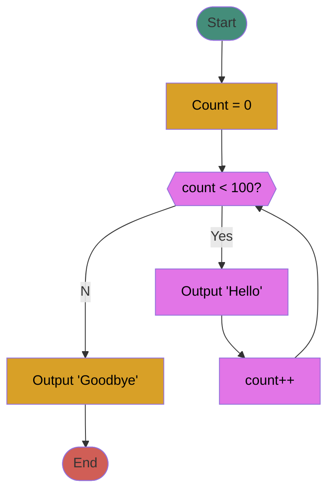
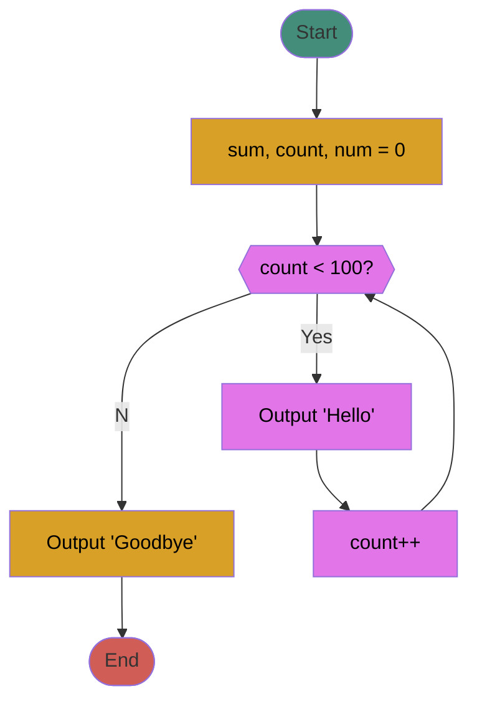

# Chapter 3: Loops, loops, and more loops
## What this lecture will cover...
### Loops  
- What they are  
- Different parts of a loop  
- Different types of loops  
	- while loop  
	- for loop  
	- do-while loop  
- Nested loops  
- How to use loops to process user input
### Background
With most programs we write, we will want to repeat a specific  
action/task/chunk of code more than once.  
###### Examples:  
	- Processing user input.  
	- ATMs: The menu loops until the user selects the option to quit.  
- Loops in programming allow us to repeat a chunk of code as many times  
as we want without having to retype the code over and over again.  
- C++ has the following loops available:  
	- `while`
	- `for `
	- `do-while`
### General Format for Loops
- Regardless of the loop type, there are important “parts” of a loop that you should keep in mind  
to make sure it works properly.  
- Initialization Statement
	- The initialization statement will initialize the variable that will control the loop, or the loop control variable (LCV).
	This variable will be the main determinant of how many times the loop will execute and will typically be part of the loop condition.  
-  Loop Condition
	- For while and for loops, this condition must evaluate to TRUE in order for the loop to begin and continue. (do-while is a little different).  
	- The LCV value is typically checked here.  
	- Once this condition evaluates to FALSE, the program breaks out of the loop and proceeds to the statement directly after the end of the loop.  
	- The condition can be made up of a Boolean expression, Boolean variables, integers, cin statements, etc.  
-  Body
	- Contains the statements/code that you wish to repeat while the loop runs.  
	- The loop body is able to use variables that are declared outside of the loop, and you can declare new variables inside the loop. Loop variables will only exist while the loop is running.  
-  Update Statement
	- At some point in your loop, you need to make sure to update the LCV so that eventually your loop will end.  
	- Without this, you risk having an infinite loop.

### `while` Loop
The while loop executes a block of code repeatedly WHILE its condition  
continues to evaluate to TRUE.  
###### C++ Syntax
```c++
initialization statement;
while(condition){
	//Body of loop
	//Update statement;
}
```

### Example: Write a program to display “Hello” 100 times

```c++
/*
 * The following program will use a while loop to display 
 * "Hello" 100 times
 */
#include <iostream>
using namespace std;

int main()
{
	//initialization statement
	int count = 0; // 1) Count set to 0
	//the beginning of the while loop
	while(count < 100) // 2) The condition is checked, if true, loop starts
	{
		//the body of the loop
		cout << "\tHello\n";
		count++; // 3) This code runs, count increased by 1
	} // 4) go back to 2)
	cout << "Goodbye!\n"; // 5) as soon as condition is false, will go to line directly after loop
	return 0;
}
```

### Example: Write a program that prompts the user for 5 positive integers, and prints the sum.



```c++
/*
 * This program prompts the user for 5 positive integers and prints 
 * their sum
 */
#include <iostream>
using namespace std;

int main()
{
	//initialize variables
	int sum = 0, num = 0, count = 0;
	//start of while loop
	while(count < 5){
		//body of the loop that will repeat
		cout << "Enter a positive number:";
		cin >> num;
		//check that it is positive
		if(num<=0)
			cout << "The integer must be greater than zero!\n";
		else{
			//positive int
			sum += num;//same as sum = sum + num
			count++; //increase count by 1
		}
	}//end of while
	cout << "The sum of the 5 integers is: " << sum << "\n";
	return 0;
}

```