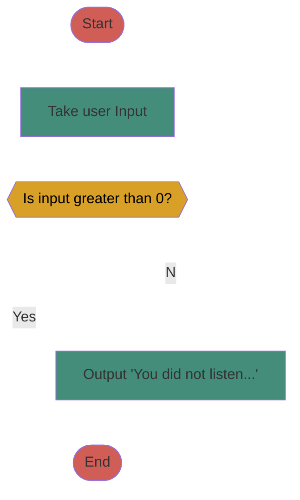
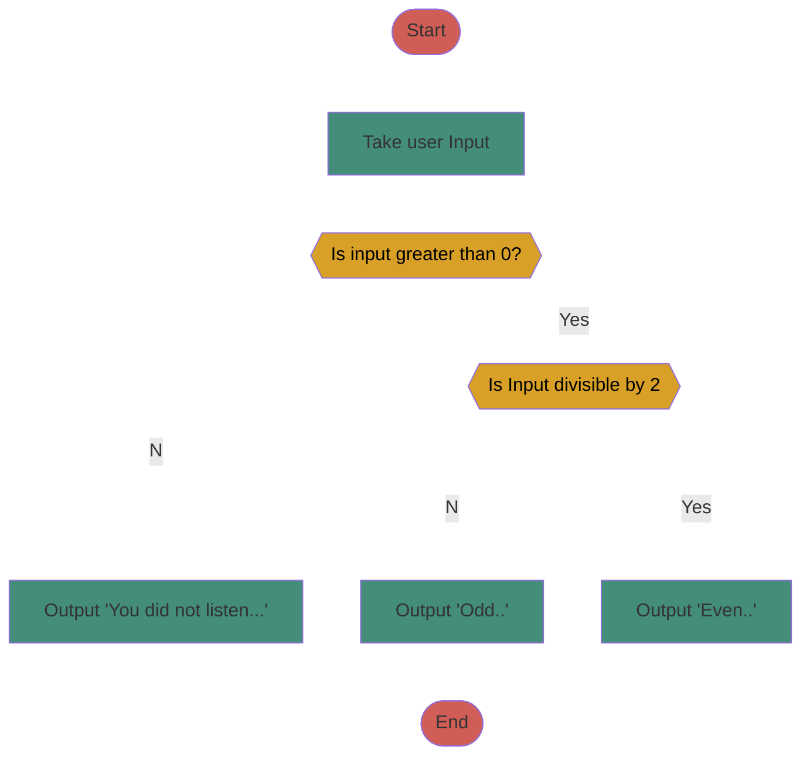
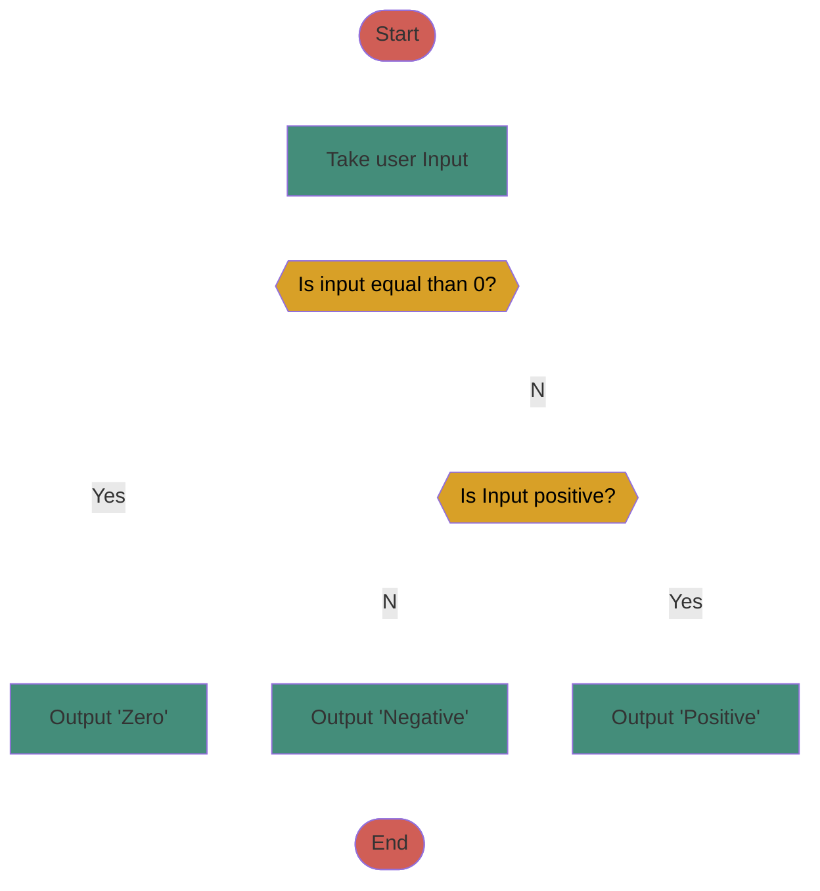

# Chapter 3: Control Flow: if-else, relational operators, boolean operators
## Background 
At this point in the course, the programs we have written have a very linear flow. There is a set of instructions we give the program for it to make it from point a to point b, and it does not veer off or go in different directions.

	But in many cases, we nee d to control what the program does based on user input, or the state of a variable. We want to control the flow of our program as it runs to give us multiple options for routes it can take.

## The `if` Statement
- The `if` statement is used to implement a decision in the program. It is made up of a condition and a body.
	- The condition of an `if` statement is made up of an expression that evaluates to TRUE or FALSE. It typically compares values using relational operators.
	- The body of an `if` statement is made up of either one statement or multiple statements. These statements will run ONLY if the condition evaluates to TRUE.

[[testing markdown file]]
###### C++ Syntax for if statements
```c++
if(condition)
	single statement body
```

```c++
if(condition) {
//multiple statements body
}
```

- If there is more than one statement in the body, you MUST use curly braces.




__if.cpp__
```c++
//Program Description: Example program for a simple if statement
#include <iostream>  
using namespace std;  
int main()  
{
	//initialize variables
	int num = 0;
	//prompt user for a value
	cout << "Please enter a number greater than zero:";
	cin >> num;//store user input into variable
	cout << "You entered: " << num << "\n";
	//this if statement will check if the number
	//entered is less than or equal to zero
	//if, and only if, it is true, the body of the if statement will run
	if(num <= 0)
	cout << "You did not listen to my instructions!\n";
	return 0;
}
```

## Relational Operators
The condition of `if` statements typically compares values with one another.  
To do this comparison, we use relational operators.
|Operator Name|Operator|Example Expression|
|-|:-:|:-:|
|Equal To|\=\=|a \=\= b|
|Not Equal To|!=|a != b|
|Less Than|<|a < b|
|Greater Than|>|a > b|
|Less Than or Equal To|<=|a <= b|
|Greater Than or Equal To|>=|a >= b|

These operators are used to compare the values between two expressions. The expression demonstrated can be  
either TRUE or FALSE.
###### Example
`int a = 10, b = 12, c = 5;`
|Expression|True or False?|
|-|-|
|a \=\= b|False|
|a+5 > b|True|
|c % 2 \=\= 0|False|
|b+2<=14|True|

## The `if-else` statement  
- You can also pair an `if` with an `else`.  
	- If the condition following the `if` is TRUE, the body of the `if` will execute.  
		- If the condition following the `if` is FALSE, the body of the else will execute.  
	- Only ONE body will run.  
	- C++ Syntax for if-else statements  
```c++
if(condition)
	//single statement body
else
	//single statement body
	```
```c++
if(condition) {
	//multiple statements body
}
else{
	//multiple statement body
}```
- Note: an `else` does not have a condition associated with it. Its performance is based on  
whether the previous condition(s) evaluates to TRUE or FALSE
###### Example



__if_else.cpp__
```c++

//Program Description: Example program for a simple if-else statement
#include <iostream>
using namespace std;

int main()
{
	//initialize variables
	int num = 0;
	cout << "Please enter a number greater than zero:";
	cin >> num;
	cout << "You entered: " << num << "\n";
	
	//this if statement will check if the number
	//entered is less than or equal to zero.
	if(num <= 0)
		cout << "You did not listed to my instructions!\n";
	//this else will only run if the above if evaluates to false
	else{
		//if the number is greater than zero, the following
		//if statement will check if it is divisible by 2
		if(num % 2 == 0) // check if num is even
			cout << num << " is even.\n";
		else
			cout << num << " is odd.\n";
	}
	//regardless of whether the if or the else above runs, the program will always end
	return 0;
}

```

# The `if(),else if()...else` statement
-   When writing a program that has more  
than 2 possible outcomes, we can use a  
sequence of if/else if/else if/else  
statements.  
- When your program encounters an if-else  
branch like this, the conditions will be  
tested from top to bottom.  
- As soon as one condition is true, it runs  
the statements within that if, and does not  
check any other conditions.  
- If none of the conditions are true, it will  
run the body of the else.

###### Example
```c++
if(condition 1){
	//Body
}
else if(condition 2){
	//Body
}
else if(condition 3){
	//Body
}
...
else if(condition n){
	//Body
}
else{
	//Body will run if all else false
}
```

###### Example

__if_else_if.cpp__
```c++
//Program Description: Example program for a simple if-else statement
//that prints whether a number is negative, zero, or positive
#include <iostream>
using namespace std;

int main()
{
	//initialize variables
	int num = 0;
	//prompt the user for an integer
	cout << "Enter an integer:";
	cin >> num;
	
	//the program will check the following conditions from top to bottom
	//Once one evaluates to true, it will execute its body and ignore the remaining
	//ones. If none are true, the final else will run
	if (num == 0)
		cout << "You entered zero.\n";
	else if(num > 0)
		cout << "You entered a positive integer.\n";
	else 
		cout << "You entered a negative integer.\n";
	
	return 0;
}

```
# Boolean/Logical Operators  
- There may be times in our programs when running certain code is dependent on multiple conditions.
	- Sometimes all conditions need to be true.  
	- Sometimes only one needs to be true.  
- We can use Boolean operators to combine our conditions!  
- Boolean operators combine conditions where the overall expression will result in either TRUE or FALSE.  
	- `&&` - AND operator  
	- `||` - OR operator

# `&&` - AND Operator: ALL must be TRUE
- Combines two or more conditions where the overall result is true if and only if ALL conditions are true.  
- You can combine as many conditions as you want.  
- C++ Syntax for using the AND operator  
	- Can user either `&&` or `and`

```c++
if(condition 1 && condition 2 &&...)
	...
```
```c++
if(condition 1 and condition 2 and...)
	...
}```

###### Logic Table for AND
|A|B|A && B|
|-|-|:-:|
|True|True|True && True = True|
|True|False|True && False = False|
|False|True|False && True = False|
|False|False|False && False = False|

# `||` - OR Operator: Just ONE needs to be TRUE
- Combines two or more conditions where the overall results is TRUE if AT LEAST ONE condition is true.
- You can combine as many conditions as you want.  
- C++ Syntax for using the OR operator  
	- Can user either `||` or `or`

```c++
if(condition 1 || condition 2 ||...)
	...
```
```c++
if(condition 1 or condition 2 or...)
	...
}```

###### Logic Table for AND
|A|B|A && B|
|-|-|:-:|
|True|True|True && True = True|
|True|False|True && False = True|
|False|True|False && True = True|
|False|False|False && False = False|

# Representing ranges with Boolean Operators
- You can use a combination of Boolean operators and conditions to make sure a value is within a range.
- Consider the following number line. Where the red arrow show the values that we want to represent. An enclosed box includes the value, and open box excludes the value.
###### Number Line 1:

- Condition 1: `if(x <= -2 || x >= 1)`

###### Number Line 2:

- Condition 2: `if(x < -2 || x >= 1)`

###### Number Line 3:

- Condition 3: `if(x > -2 || x <= 1)`

# Combination of Boolean Operators
### You can use any combination of && and || in a condition
  
- The `&&` operator takes precedence over `||`
	- ###### Examples:  
		- `if( TRUE || TRUE ) = TRUE ` 
		- `if (TRUE || FALSE && TRUE) = FALSE`  
		- `if((TRUE || FALSE) && TRUE) = TRUE`

# Shipping Program Example  
Write a program that calculates a shipping rate for a company based on the destination and weight of the package.  
	- If the package is sent outside the U.S, shipping is $70.00.
	- If the package is sent within the U.S and the weight is more than 10lbs, shipping is $25.00
	- If the package is sent within the U.S and the weight is between 1-10lbs, shipping is $7.50
	- If the package is sent within the U.S and the weight is less than 1 lb, shipping = $2.50.
	- If the package is sent within the U.S to Alaska (AK) or Hawaii (HI), the shipping rate is $40.00, regardless of weight.

```c++
/*
* Name: James Wibowo
* File Name: Shipping.cpp
* Program: This program will calculate shipping rates based on destination and weight.
* Date: 09/07/22
*/

#include <iostream>
#include <string>
using namespace std;

int main()
{
	//init
	double packWeig;
	string packDest,packDestState;
	AllDest = 
	//input weight and destination
	cout << "Package Weight?\nLbs: ";
	cin >> packWeig;
	cout << "Package Country Destination? (Enter Two Letter Code): ";
	cin >> packDest;
	if (packDest == "US")
	{
		cout << "Package State Destination? (Enter Two Letter Code): ";
		cin >> packDestState;
		if (packDestState == "AK")
		{
			cout << "\n\nShipping Cost: $40.00";
			return 0
		}
		else if (packDestState == "HI")
		{
			cout << "\n\nShipping Cost: $40.00";
			return 0
		}
		else
		{
			if (packWeig < 1)
			{
				cout << "\n\nShipping Cost: $2.50";
				return 0;
			}
			else if (packWeig <= 10)
			{
				cout << "\n\nShipping Cost: $7.50";
				return 0
			}
			else
			{
				cout << "\n\nShipping Cost: $25.00";
				return 0
			}
		}
	}
	else
	{
		cout << "\n\nShipping Cost: $70.00";
		return 0
	}
	return 0;
}

```


