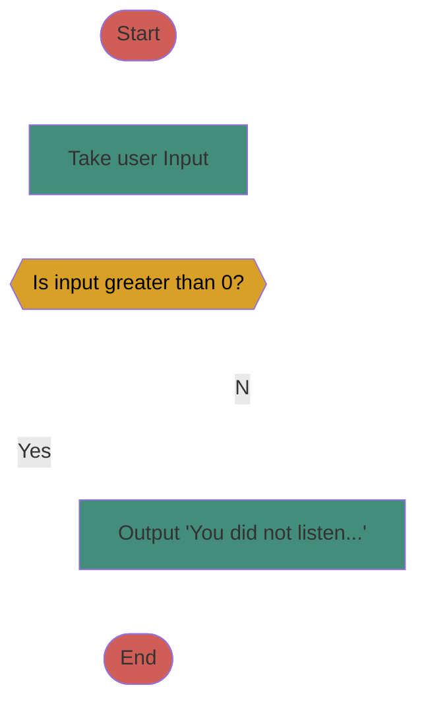

```mermaid
graph TD;
    A([Start]):::Red-->B;
    B[Take user Input]:::Green-->C;
    C{{Is input greater than 0?}}:::Yellow--No-->D;
    C--Yes-->H([End]):::Red;
    D[Output 'You did not listen...']:::Green-->H;
	classDef Red fill:#d05e56;
	classDef Yellow fill:#d8a027, color:#000;
	classDef Green fill:#448d7a;
	linkStyle default stroke-width:2px,fill:none,stroke:white
```

