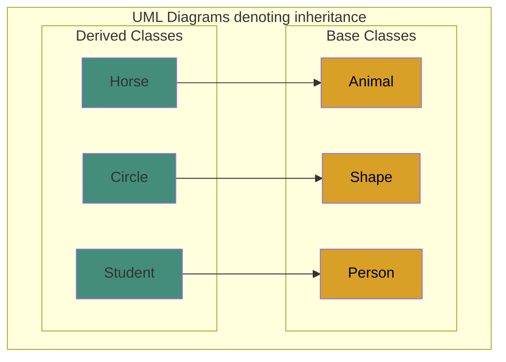
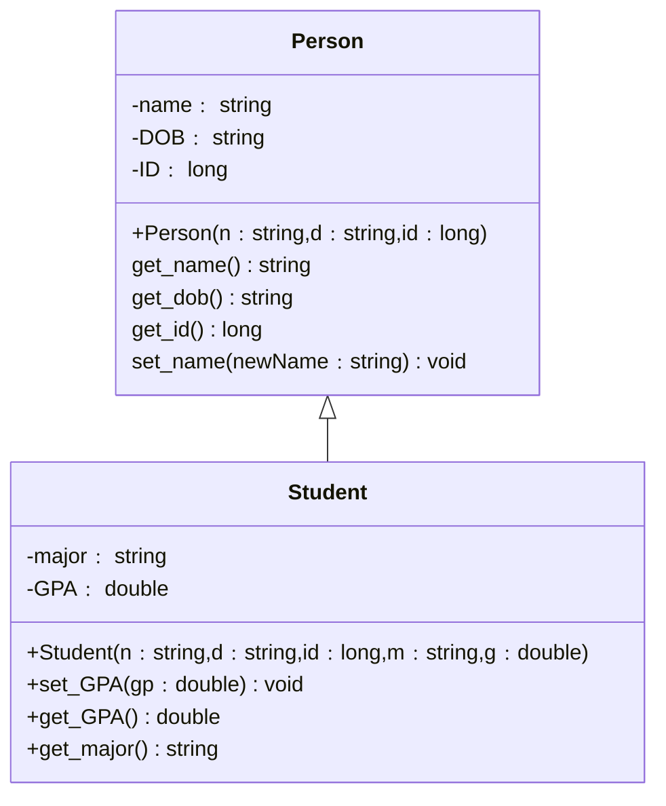

# Chapter 8: Inheritance
###### CSE 2010 - Week 12

## Background
In object-oriented programming, classes are not used in isolation, but instead used in
relation to each other.

Consider the following classes:
```
● Animal
● Cat
```
The concept of an animal is a general one, while a cat is a specific type of animal. All
cats are animals, but not all animals are cats.

This is the concept behind **_inheritance._**

## Inheritance
- Inheritance in object-oriented programming derives a more specific concept from a more general one.
- With inheritance, we have a base class and derived classes.
- Base Class:
	- A class that describes a general concept.
		- Person
		- Animal
		- Shape
		- Employee
- Derived Class:
	- A class that inherits from a base class and is a more specialized case.
		- Student
		- Cat
		- Circle
		- Manager

## Unified Modeling Language (UML)
- To show the relationship between inherited classes in C++, we can use the Unified Modeling Language (UML).
- UML is a language that graphically shows the relationship between classes and objects.
- Classes are shown in rectangular boxes, while the inheritance relationship is shown by a solid line ending in a hollow triangle that goes from the specific class to the general class.


## Relationship between the base and derived class
- A specific concept must have the characteristics of the general concept, but it can have more.
- In C++, we say that a derived class extends its base class, meaning the derived class must have all of the data members and member functions of the base class, but it can add to the list.
- There are 3 ways a derived class can inherit a base class:
	- Private inheritance
	- Protected inheritance
	- **Public inheritance**

- The default type of inheritance is private, but private and protected aren’t really used.
- So in this class we will focus on public.
- If you want to learn more about private and
protected inheritance, [read me.](https://isocpp.org/wiki/faq/private-inheritance)

#### Consider the following classes...
- Person
	- A person has a name, date of birth (DOB), and ID #.
- Student
	- A student inherits the data members and member functions from Person.
	- Additionally, a student has a major and GPA.
- See a more extended UML Diagram to show the relationship between these classes 

- The type of data members and member functions is shown after the member names separated by a colon.
- The minus signs define the visibility of data members as private; the plus signs define them as public.

### Class Definitions
```
Syntax for a derived class definition:

class DerivedClassName:public BaseClassName
{
};
```

###### Base Class: Person
```c++
/*
 * Filename: Person.h
 * Definition of the Person class
 */
#include <string>
using namespace std;
#ifndef Person_H
#define Person_H
class Person{
	private:
		string name;//a person's full name
		string DOB;//a person's date of birth
		long ID;//a person's ID #
	public:
		Person(string n, string d, long id);//constructor
		~Person();//destructor
		string get_name() const;//return name
		string get_dob() const;//return DOB
		long get_id() const;//return ID
		void set_name(string newName);//update name
};
#endif
```

###### Derived Class: Student
```c++
/*
 * Filename: Student.h
 * Definition of the Student class, which inherits the Person class
 */
#include "Person.h"
#ifndef STUDENT_H
#define STUDENT_H
class Student:public Person{
	private:
		string major;//student's major
		double GPA;//student's gpa
	public:
		//note how many parameters the derived class contructor has
		Student(string n, string d, long id, string m, double g);
		~Student();
		void set_GPA(double gp);
		double get_GPA() const;
		string get_major() const;
};
#endif 
```

Student inherits all member functions and data members of the Person class.

## Defining the Derived Class Constructors
- The constructor(s) of a derived class has two tasks:
	- Initialize the base object
	- Initialize its own data members

###### Syntax:
```c++
DerivedClassName::DerivedClassName(parameters)
:BaseClassName(parameters for base class),initialization list for remaining data members
{

}
```

## Class Member Function Definitions
###### Base Class: Person
```c++
/*
 * Filename: Person.cpp
 * Definition of the Person class member functions
 */
#include "Person.h"

//constructor
Person::Person(string n, string d, long id):name(n),DOB(d),ID(id){
}
//destructor
Person::~Person(){
	cout << "Destroying Person object with name: " << name << "\n";
}
//getters that return private data members
string Person::get_name()const{
	return name;
}
string Person get_dob()const{
	return DOB;
}
long Person::get_id()const{
	return ID;
}
//update person's name
void Person::set_name(string newName){
	name=newname;
}
```

###### Derived Class: Student
```c++
/*
 * Filename: Student.cpp
 * Definition of the Student class member functions
 */
#include "Student.h"
//constructor that involves Base class constructor
Student::Student(string n, string d, long id, string m, double g)
	:Person(n,d,id), major(m),GPA(g){
}
//destructor
Student::~Student(){
	cout << "Destroying Student with name: " << get_name() << "\n";
}
//update GPA
void Student::set_GPA(double gp){
	GPA = gp;
}
//getters to return private data members
double Student::get_GPA()const{
	return GPA;
string Student::get_major()const
	return major;
}
```

## Main.cpp
```c++
/*
 * Filename: main.cpp
 * Program that uses the Person and Student classes
 */
#include <iostream>
#include "Student.h"
using namespace std;

int name()
{
	//Declare a Person object
	Person person1("Fred Rodgers","03-20-1928",100003);
	cout << "Person Name: " << person1.get_name() << "\n";
	cout << "\tDOB: " << person1.get_dob() << "\n";
	cout << "\tID: " << person1.get_id() << "\n";
	
	//Declare a Student object
	Student student1("Bob Ross","10-29-1942",100005,"Art",4.0);
	cout << "Student Name; " << student1.get_name() << "\n";
	cout << "\tDOB: " << student1.get_dob() << "\n";
	cout << "\tID: " << student1.get_id() << "\n";
	cout << "\tMajor: " << student1.get_major() << "\n";
	cout << "\tGPA: " << student1.get_GPA() << "\n";
	
	return 0;
}
```

###### makefile
```makefile
main: main.o Student.o Person.o
	g++ -o main
main.o: main.cpp Student.h
	g++ -c main.cpp
Student.o: Student.cpp Student.h
	g++ -c Student.cpp
```
Let’s run this to see what we get!


## Overloaded vs Overridden Member Functions

```
● It is possible to have functions with the same name in the base class and its derived class(es).
● Overloaded Member Functions:
○ Functions with the same name, but different parameters.
○ They can be used in the same or different classes without being confused with each other.
○ Consider the following:
Person Class Student Class
void set(long newID); void set(string newMajor);
```
```
● A student object could use both functions, depending on what the parameter datatype is, the compiler would use the
● appropriate one.A person object could only use it’s own set() function.^
● Overridden Member Functions:
○ Functions with the same name and same parameters.
○ Consider the following:
Person Class Student Class
void print(); void print();
```
```
● The compiler will default to use the function that belongs to the class of the object that has invoked it.
● It is possible to delegate a specific function. For example, if a Student member function wanted to call
the print function for person, we could write○ Person::print()
```

## Dependencies and Compositions

###### ● Not all relationships between classes can be described as inheritance.

###### ● Dependency:

```
○ Class A depends on Class B if Class A somehow uses Class B.
○ Class A depends on Class B if Class A cannot perform its complete task without class B.
■ Example:
● Last chapter we had an Employee class and a Department class.
● The Department class had two Employees: A receptionist and a secretary
○ For UML, dependency between classes is denoted with a dotted line ending with an arrow.
```
###### ● Composition:

```
○ Describes the relationship between two classes where Class A has a Class B, and the
lifetime of the Class B object depends on Class A.
○ Class B cannot exist without Class A.
○ For UML, composition between classes is denoted with a solid line ending with a solid
diamond.
```

## Registration System Example

```
● Lets design a simple registration system for a small department at a university.
● There will be some inheritance, dependency, and composition.
● We will use 6 classes:
○ Person: Contains a name and DOB
○ StudentSchedule : Contains a size (int) and course names (array of strings)
○ Student : Inherits the Person class. Additionally contains a schedule
(StudentSchedule)
○ CourseRoster : Contains a size (int) and a roster of students (array of strings)
○ Course : Contains a name(string), # of units (int), and a roster (CourseRoster)
○ Registrar : Uses the Student and Course objects
```

#### Registration System UML Diagram


## Person Class


## Student Schedule Class


## Student Class

```
Note: When dealing with object pointers, we’ve been using the notation:
(*objectName).functionName(),
But we can also use: objectName->functionName().
```

## Course Roster Class


## Course Class


## Registrar Class


##### Now that we’ve defined all our classes, lets see a program that uses them.


