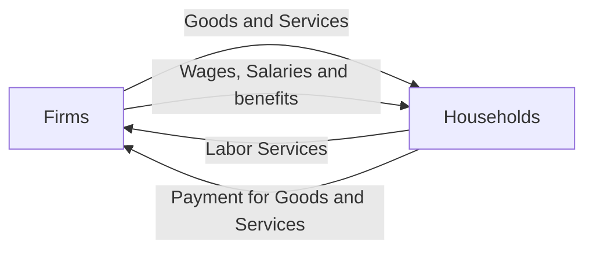

## Problems that econ can address
- Scarce time
	- how do i decide how much time to work and how much time to study
- Resources are scarce
	- How do i organize my team to maximize my revenues?
- Our economy is in a recession and many people are out of work
	- How do we use our recources to turn the economy around and help people get jobs?

## Economic data
- Econ data refers to quantitative and qualitative information about the economy
- Quantatitive data
	- refers to numbers
		- wages
		- revenues
		- prices
			- very common in econ 
- Qualitative data
	- qualities or characteristics
		- occupation
		- race
		- sex
		- religion
		- political affiliation
		- origin country
			- this type of data is becoming increasingly common in econ

## Division of Labor
- According to Adam Smith
	- the most importation of examples of scarce resource is **time**
		- if a business has a week to fill an order, time becomes scarce
	- ex
		- introduce the **Division of Labor**
			- have each worker specialize in one step
			- ex
				- a doctors office has one worker handle scheduling and another handle insurance claims
				- a family has one person drive kids to school and anothe rperson buy groceries for dinner
				- a coffee shop has one worker take orders from customers and another worker make the coffee
				- a land scaping company has one worker handle the lawn and another worker handle the trees

## Why does division of labor work?
- Specialization
- etc (fast)

## Microeconomics vs Macroeconomics

- Microeconomics
	- individual agents
- Macroeconomics
	- the entire economy as a whole
- ex
	- micro
		- what determines how households spend their budgets
		- how do people decide whether to work and how much to work
		- how do people decide how much to save
		- how do business owners decide how many workers to hire?
	- macro
		- what causes the economy to slow down?
		- what determinds how many workers are employed in the economy
		- what causes prices to go up?
		- (how) should governments support their economy?

## Economics models
- Econ models are simplified ways of thinking about the economy
- since the economy is so complex, economists have found ways of "boiling down" the relationships in it
- this "boiling down" is called modeling
	- imagine building a model airplane or train
		- its not the exact same thing but it gives a good estimate

# Circular Flow Diagram

Example of an economic model.
the circular flow diagram describes how goods and services and income flow through an economy

- **Households** are **groups of people** like families or people living alone or with others
- **Firms** are **businesses**

(personal businesses act like households and firms)

## How are economies organized?
- For most people, econ decisions are primarily made in markets
- Markets are guided by prices and quantities
	- people decide how much of something to buy based on its price
		- both jobs and goods

## Market organize most, but not all econ activity

# Summary
- Economics is the study of 

## The concept of tradeoff
- We defined economics as **decision under conditions of scarcity**
- a **tradeoff** is a situation in which choosing one of something leads to less of something else
	- ex
		- producing more gives us more goods and services, but possibly at the expense of addition pollution
		- working more gives you more money/income, but less time to rest or study for school
		- hiring more workers allows you to create/sell more output, but costs you more to operate

## Breaking down the tradeoff concept
- When economics study choices (consumption behavior, macro policy choices, etc.), they work with models
	- they develop a model, or a simplified view to try to understand how people make their choices
	- two examples today
		- Budget constraint from microeconomy
		- Production Possibilist Frontier (aka "PPF") from macroeconomy

## How individuals make choices based on budget contraint
- ex
	- Alex only consumes two goods, bananas and blueberries.
		- bananas cost $2 and blueberries cost $.50 each
	- suppose $10 in income
	- with his budget, he can either purces at most 5 bananas, or at most 20 blueberries
	- with this information, we can set up a budget constraint which gives a collection of all the different choices alexander can make

# Quantifying tradeoffs
- Suppose Alex is at a "best" decision (ie: he spends his entire budget) of 3 bananas, and 8 blueberries
- but suppose that Alex is getting sick of bananas, he'd prefer to consume 1 less banana
- how many more blueberries could he consume?
	- 1 more blueberry?
	- 2?
	- 3?
	- 4?
	- or more?
		- examples branches off to more complex ideas like "how much does it cost to take 2 hours off of work to go to a party"
	- Opportunity cost
		- 1 banana is 4 blueberries
		- 1 blueberry is 1/4 banana
		- $\$2*1$ is $\$0.50*4$

## Tradeoffs at the macro level
- The concept of tradeoff is widely applicable
- the ex we saw was microeconomics
- Macroeconomics also has tradeoffs
	- ie
		- the country can either provide a lot of healthcare, or a lot of education, but its hard to provide both
		- there are constraints on the size of the trained workforce, and 